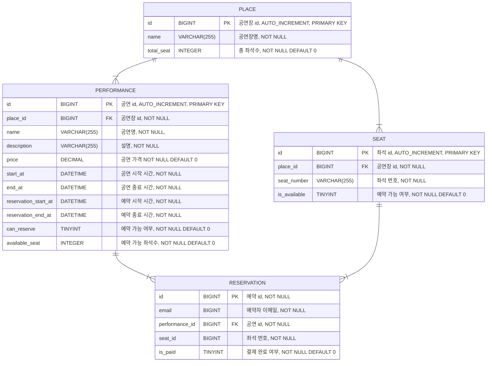

## 구현 기능

### 예매

- 공연 조회
    - 공연 종료 시간이 지나지 않은 공연 정보와 공연장, 좌석을 같이 조회한다.(eager load)
    - 예약 가능 여부에 따라 예약 가능 상태를 표시하고 예약 진행 여부를 결정한다.
    - 예약 시작 시간이 되면 예약 가능 상태를 가능으로 변경하고 종료시간이 되면 불가능으로 변경한다.
    - 예약 종료 시간 전이라도 예약 가능 상태가 불가로 변경되면 예약이 불가능하다.
- 예매
    - 예약 시작 시간이 되었을 때 예약을 진행할 수 있다.
    - 예약 종료 시간이 되면 예약이 더이상 불가능하다.
    - 하나의 예약은 하나의 공연만 포함할 수 있다.
    - 하나의 예약에 여러 좌석 선택이 가능하며, id와 user_id 복합키를 이용해서 구분한다.
    - 예매 후에 결제 여부는 기본적으로 미결제이다.

## DB 설계

